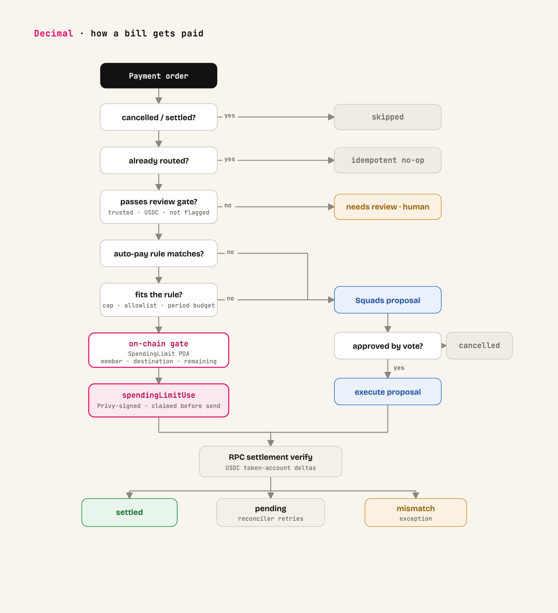

# Decimal

AI-powered accounts payable on Solana. Live on devnet at [decimal.finance](https://decimal.finance).

Drop in a vendor invoice and Decimal reads it, turns it into a structured payment order, routes it for approval, pays it in USDC, and produces an on-chain proof of payment. The money sits in the team's own Squads v4 multisig, and payment rules are enforced on-chain, so the AI does the work but can never move money outside policy.

## How a bill gets paid



1. An operator uploads a vendor invoice. A vision model extracts the payable into a structured payment order (Zod-validated, with retries).
2. New counterparty wallets go through a trust review before anything can be paid to them.
3. A router decides the path for every payment:
   - `agent_executed` — vendor and amount fit an active spending-limit policy, so the agent pays directly under a Squads spending-limit instruction.
   - `proposal_created` — anything outside policy becomes a Squads multisig proposal for member approval.
   - `needs_review` — flagged for human eyes.
4. USDC settles on Solana. The backend verifies settlement over RPC and emits a deterministic JSON proof packet.

Spending limits are bounded autonomy: a vendor allowlist, an amount cap, and a period. The policy lifecycle is itself multisig-gated, so creating, replacing, or removing a limit goes through a Squads config proposal. The program enforces the rules, not the backend. [system_explained/07-payment-routing-algorithm.md](system_explained/07-payment-routing-algorithm.md) walks through the routing in detail, verified against the code.

## What works today

- Invoice upload with vision-model extraction into structured payment orders.
- Single payment orders and CSV payment runs.
- Counterparty wallet trust review.
- The payment router: agent execution under Squads spending limits, multisig proposals, or human review.
- Spending-limit policies created, replaced, and removed through Squads config proposals.
- Squads v4 treasury creation with selected members and threshold, plus config proposals for member and threshold changes.
- RPC confirmation for proposal submission and execution.
- RPC settlement verification for app-originated USDC payments.
- Deterministic JSON proof packets for payment orders and payment runs.
- Email/password and Google OAuth auth, invite-only organizations, Privy-managed embedded personal wallets.
- Audit log and API/OpenAPI surfaces.

## Architecture

```text
frontend/        React + Vite + TanStack Query operator UI
api/             Express + Prisma API on PostgreSQL
decimal_agents/  payment-automation agent service (Vercel AI SDK) with its own eval suite
postgres/        local bootstrap SQL
config/          committed non-secret runtime config
```

Runtime dependencies:

- PostgreSQL stores durable product state.
- Solana RPC verifies Squads transactions and USDC settlement deltas.
- Privy creates and signs with embedded personal wallets.
- Squads v4 is the on-chain multisig treasury layer.
- A vision model handles invoice extraction.

## Local Development

```bash
cd api && npm install
cd ../frontend && npm install
make dev devnet
```

Useful commands:

```bash
make dev mainnet
make test-api
make test-frontend
make infra-up
make reset-data
make help
```

## API

Useful public endpoints:

- `GET /health`
- `GET /capabilities`
- `GET /openapi.json`

Main authenticated groups:

- `/organizations`
- `/organizations/:organizationId/invites`
- `/personal-wallets`
- `/organizations/:organizationId/treasury-wallets`
- `/organizations/:organizationId/squads/proposals`
- `/organizations/:organizationId/proposals`
- `/organizations/:organizationId/payment-requests`
- `/organizations/:organizationId/payment-runs`
- `/organizations/:organizationId/payment-orders`
- `/organizations/:organizationId/approval-policy`
- `/organizations/:organizationId/approval-inbox`
- `/organizations/:organizationId/audit-log`

## Proof Packets

Proof packets are canonical JSON documents with a SHA-256 digest over stable JSON. They capture:

- intent
- parties
- approval state
- Squads execution evidence
- RPC settlement verification
- source artifacts
- audit trail

They are meant to be verifiable operational records, not a private ledger and not custody.

## Configuration

Committed non-secret config:

- `config/api.config.json`
- `config/frontend.public.json`

Local secrets:

- `api/.env`
- frontend deploy env vars

Secrets never belong in committed config files.

## Status

Pre-launch. Settlement runs on Solana devnet today. Decimal is non-custodial: the treasury is the team's own Squads multisig, and Decimal never holds funds.

Not built yet:

- QuickBooks sync and reconciliation (next milestones)
- fiat on/off-ramps (planned via PSP partners)
- custody (never)
- card issuing
- private transactions
- automatic inbound collection watching

See [system_explained/README.md](system_explained/README.md) for the current engineering map.
