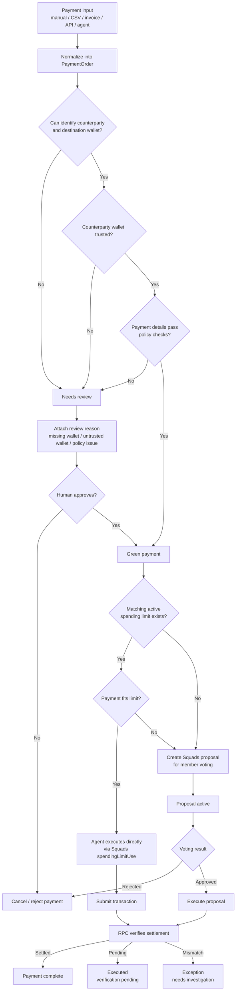
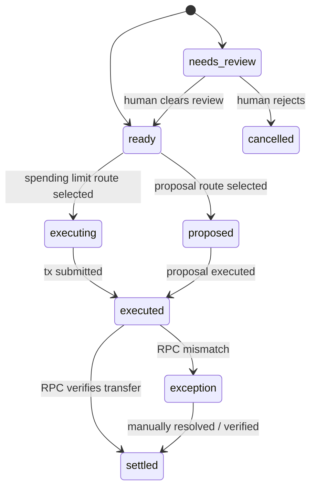
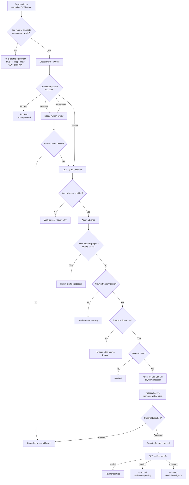
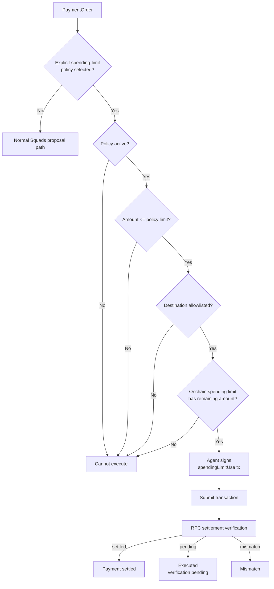
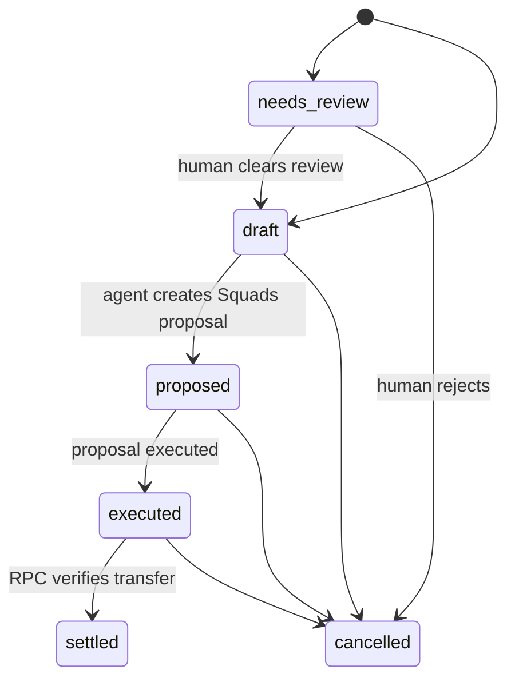

# Decimal Payment Routing Diagram

This is the current backend behavior, not the final target algorithm.

## Target Payment Algorithm

This is the flow we should move toward: every payment goes through one router.
The router decides whether the payment can be executed by an agent through a spending limit,
or whether it must become a Squads proposal for member voting.



## Target Router Pseudocode

```ts
async function routePayment(paymentOrderId: string) {
  const payment = await loadPaymentOrder(paymentOrderId);

  if (!payment.destinationWallet) {
    return markNeedsReview(payment, 'missing_destination_wallet');
  }

  if (!isTrustedCounterpartyWallet(payment.destinationWallet)) {
    return markNeedsReview(payment, 'counterparty_wallet_not_trusted');
  }

  const policyDecision = await evaluatePaymentPolicy(payment);
  if (policyDecision.status !== 'pass') {
    return markNeedsReview(payment, policyDecision.reason);
  }

  const spendingLimit = await findBestMatchingSpendingLimit(payment);
  if (spendingLimit && await canUseSpendingLimit(payment, spendingLimit)) {
    return executeWithSpendingLimit(payment, spendingLimit);
  }

  return createSquadsPaymentProposal(payment);
}
```

## Target Mental Model

Every payment has exactly one of three routing outcomes:

| Outcome | Meaning |
| --- | --- |
| `needs_review` | The payment is not safe or complete enough for automation. A human must clear or reject it. |
| `agent_executed` | The payment matched an active spending limit and the agent executed it directly. |
| `proposal_created` | The payment did not qualify for direct execution, so it entered the Squads voting path. |

The user should not have to choose between "submit", "advance", "create proposal", and "execute with spending limit".
The backend router should make that decision.

## Target State Vocabulary



Suggested product states:

- `needs_review`
- `ready`
- `proposed`
- `executing`
- `executed`
- `settled`
- `exception`
- `cancelled`

We can keep the DB state smaller if needed, but the router should internally reason with these states.

## Main Payment Flow



## Spending-Limit Path

This exists today, but it is not yet integrated into the main agent routing decision.
The frontend/backend must explicitly call the spending-limit execution endpoint.



## Current Important Gap

The main agent path does not automatically choose between:

- spending-limit execution
- Squads proposal creation
- human review

Right now, the normal agent advance path creates a Squads proposal for green payments.
Spending-limit execution is available, but separate.

## Current State Vocabulary



## Backend Files Behind This Flow

- `api/src/payments/invoice-intake.ts`: invoice extraction and review rules.
- `api/src/payments/csv-intake.ts`: CSV import and counterparty resolution.
- `api/src/payments/orders.ts`: `PaymentOrder` lifecycle and read model.
- `api/src/agents/payment-automation.ts`: agent advance into Squads proposal creation.
- `api/src/agents/spending-limit-execution.ts`: direct agent execution through Squads spending limits.
- `api/src/squads/treasury.ts`: Squads proposal, vote, execute, config, and spending-limit primitives.
