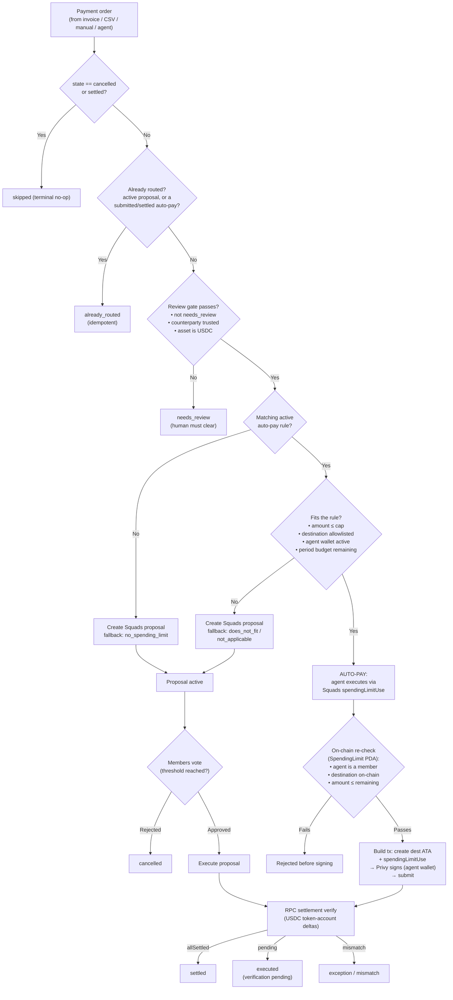
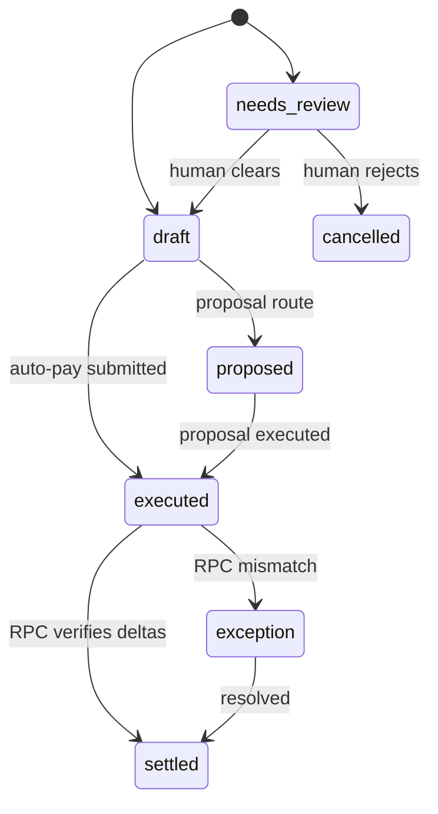

# 07 Payment Routing Algorithm

**Verified against the code on 2026-06-15.** Every claim below maps to a file and line.
This supersedes the old root `diagram.md`, which described the unified router as a future
target. It is no longer a target: it is shipped.

## Naming

- **Auto-pay** is the product concept: the agent pays an approved bill on its own, within
  rules the team set once.
- Under the hood, auto-pay is implemented with a **Squads spending limit**. The on-chain
  account is a `SpendingLimit` PDA; the agent pays through the `spendingLimitUse`
  instruction; the database model is `spendingLimitPolicy`. Those primitive names are kept
  verbatim here because they are the real Squads mechanics.

So: *auto-pay* = the feature; *spending limit* = the Squads primitive it is built on.

---

## One router decides everything

Every payment an agent advances goes through one function. There is no longer a separate
"call the auto-pay endpoint" path bolted on beside proposal creation.

- Entry point: `advancePaymentOrderWithAgent` — `api/src/agents/payment-automation.ts:107`
- The router itself: `routePayment` — `api/src/payments/algorithm.ts:154`

`routePayment` is generic and dependency-injected. `payment-automation.ts` supplies the
real implementations (`loadPaymentOrder`, `findExistingRoute`, `evaluateReviewGate`,
`findBestMatchingSpendingLimit`, `canUseSpendingLimit`, `executeWithSpendingLimit`,
`createSquadsProposal`). The algorithm and its wiring are deliberately separable so the
decision logic can be unit-tested without Solana.



---

## The five outcomes

The router returns exactly one of these (`algorithm.ts:98-138`). The old diagram listed
three; the real system has five, because idempotency and terminal-state skipping are
first-class outcomes, not afterthoughts.

| Outcome | Route | Meaning |
| --- | --- | --- |
| `skipped` | `none` | Payment is already `cancelled` or `settled`; nothing to do. |
| `already_routed` | `existing` | An active proposal or a submitted/settled auto-pay already exists. Re-running is a safe no-op. |
| `needs_review` | `human_review` | Failed the safety gate (untrusted counterparty, non-USDC, or already flagged). A human must clear it. |
| `agent_executed` | `spending_limit` | **Auto-pay.** Matched an active rule and fit it; the agent paid directly. |
| `proposal_created` | `squads_proposal` | Did not qualify for auto-pay; entered Squads voting. The fallback reason is recorded. |

The router (matches `routePayment`, `algorithm.ts:154-231`):

```ts
async function routePayment(context, deps) {
  const payment = await deps.loadPaymentOrder(context);

  if (payment.state === 'cancelled' || payment.state === 'settled')
    return skipped(payment);

  const existing = await deps.findExistingRoute(payment, context);
  if (existing.status === 'exists') return alreadyRouted(payment, existing.route);

  const review = await deps.evaluateReviewGate(payment, context);
  if (review.status === 'needs_review')
    return needsReview(payment, await deps.markNeedsReview(payment, review, context));

  const rule = await deps.findBestMatchingSpendingLimit(payment, context);
  if (!rule)
    return proposalCreated(payment, await deps.createSquadsProposal(payment, context, noRuleFallback()));

  const fit = await deps.canUseSpendingLimit(payment, rule, context);
  if (fit.status === 'pass')
    return agentExecuted(payment, rule, await deps.executeWithSpendingLimit(payment, rule, context));

  return proposalCreated(payment, await deps.createSquadsProposal(payment, context, fitFallback(fit)));
}
```

---

## Step 1 — Idempotency (`findExistingRoute`, `payment-automation.ts:207`)

Before doing anything, the router asks: is this payment already on a rail?

- An active `decimalProposal` (provider Squads, `semanticType: 'send_payment'`, status not
  in `rejected/cancelled/failed`) → already on the proposal rail.
- A `spendingLimitExecution` with status `submitted` or `settled` → already auto-paid.

Either short-circuits to `already_routed`. This is what makes the agent safe to retry —
re-advancing a payment never double-pays.

## Step 2 — The review gate (`evaluateReviewGate`, `payment-automation.ts:255`)

The gate collects reasons; any reason means `needs_review`:

- `state === 'needs_review'` → `payment_order_needs_review`
- `counterpartyWallet.trustState !== 'trusted'` → `counterparty_wallet_not_trusted`
- `asset.toLowerCase() !== 'usdc'` → `unsupported_asset`

`markNeedsReview` writes the reasons onto the payment order and emits a
`payment_order_needs_review` event (`payment-automation.ts:282`). Note the serializer maps
the `unsupported_asset` case to a harder `blocked` status, not just `needs_review`
(`payment-automation.ts:437`).

## Step 3 — Match an auto-pay rule (`findBestMatchingSpendingLimit`, `payment-automation.ts:323`)

A single Prisma query finds the tightest active rule the payment fits. The rule must be:

- `status: 'active'`, asset matches (case-insensitive)
- `amountRaw >= payment.amountRaw` — the cap is at least the payment (payment fits under it)
- on an active Squads treasury (`source = squads`, `isActive`)
- backed by an **active** automation agent and an **active** agent wallet that has a
  `providerWalletId` (i.e. a real signer exists)
- has the payment's counterparty in its `destinations` allowlist (matched by both
  `counterpartyWalletId` and `walletAddress`)

Ordered by `amountRaw asc` then `createdAt asc`, so the smallest sufficient cap wins. No
rule → straight to a proposal with fallback `no_spending_limit`.

## Step 4 — Confirm fit (`canUseSpendingLimit`, `payment-automation.ts:359`)

A second, explicit fit check (defense in depth — the match query and the fit check are
separate so the reason is auditable):

- rule not active → `not_applicable` (`spending_limit_not_active`)
- `amountRaw > rule.amountRaw` (static cap) → `does_not_fit` (`amount_exceeds_limit`)
- destination not allowlisted → `does_not_fit` (`destination_not_allowlisted`)
- agent wallet/agent not active → `not_applicable` (`agent_wallet_unavailable`)
- on-chain limit not synced yet → `not_applicable` (`spending_limit_not_synced`)
- `amountRaw >` on-chain remaining period budget → `does_not_fit` (`period_budget_exhausted`)

The last two read the live `SpendingLimit` PDA via `loadOnchainSpendingLimitRemaining`
(`spending-limit-execution.ts`). This matters: the static cap is not the spendable balance
— the period budget is what remains on-chain. Checking it *here*, in the fit step, means a
payment that fits the cap but has exhausted the period budget falls back to a Squads
proposal (the same outcome as an over-cap payment), instead of passing the fit check and
then hard-failing at execution. The on-chain check at execution time remains as a final
guard.

`pass` → auto-pay. Anything else → proposal, with the precise fallback reason carried
through (`algorithm.ts:285`).

---

## Auto-pay execution — the deterministic core (`executePaymentOrderWithSpendingLimit`, `spending-limit-execution.ts:153`)

This is the part that makes "an agent pays on its own" safe. The agent cannot pay outside
the rule because the rule lives on-chain, in the Squads program.

**Off-chain re-validation** (lines 161-186): policy active, treasuries match, USDC, amount
≤ cap, destination allowlisted, agent wallet has a provider signer.

**On-chain re-validation** — this is what the old diagram missed entirely. It loads the
real account and checks the chain, not the database (`spending-limit-execution.ts:188-201`):

```ts
const account = await runtime.loadSpendingLimit(new PublicKey(policy.spendingLimitPda));
if (!account) throw badRequest('Onchain spending limit account is not available yet.');
if (!account.members.some(m => m.toBase58() === agentWallet))      throw badRequest('Agent not a member.');
if (!account.destinations.some(d => d.toBase58() === destination)) throw badRequest('Destination not on the limit.');
if (paymentOrder.amountRaw > BigInt(account.remainingAmount))      throw badRequest('Exceeds remaining for the period.');
```

`remainingAmount` is the live, on-chain period budget. Even if every database row were
wrong or tampered with, the Squads program would still reject a payment that breaks the
limit. The backend is not trusted to enforce the cap; the chain is.

**Claim → build + sign + send**: the order is reserved with a `prepared`
`spendingLimitExecution` row *before* anything is sent (see the double-pay guard below),
then a single v0 transaction is built with two instructions —
`buildDestinationAtaCreateInstruction` (idempotently ensures the destination USDC ATA
exists) then `multisig.instructions.spendingLimitUse({ multisigPda, member: agent,
spendingLimit, mint: USDC, vaultIndex, amount, decimals, destination, memo, programId })`.
The agent's wallet is a Privy-managed signer (`signPrivySolanaTransaction`); Decimal never
holds a private key. The signature is written back onto the reservation (`submitted`)
immediately after send, before verification, so a crash cannot orphan the payment.

**Verify + persist atomically**: `verifySettlementSoft` wraps RPC verification so a slow RPC
degrades to `pending` rather than failing the payment. Then one Prisma `$transaction`
updates the reservation row to its final status and writes everything together — the payment
order state (`settled`/`executed`), the transfer-request state, two audit events, the agent
wallet's `lastUsedAt`, and the rule's tracked remaining amount. All or nothing.

### Concurrency, idempotency & recovery

**Double-pay guard.** Two agent advances racing on the same payment order must not both pay.
The reservation row is inserted *before* the on-chain send and is protected by a unique
partial index, `uq_spending_limit_executions_active_payment_order`
(`payment_order_id WHERE status IN ('prepared','submitted','settled','mismatch')`). The
second racer hits the unique violation on the reservation insert and is rejected *before* a
second payment is sent — not merely deduplicated after the fact. A pre-send failure releases
the claim (`failed`); once money has moved the claim is never released.

**Settlement reconciler** (`settlement-reconciler.ts`). Because verification is best-effort,
a payment can land on-chain while the row still reads `submitted` (the "stuck verifying"
case). A background loop re-verifies `submitted` executions by signature and promotes them to
`settled` (or marks `mismatch` / releases a `tx_failed`), and reclaims stale never-sent
`prepared` reservations so they stop blocking retries. It is the asynchronous safety net
behind the synchronous happy path.

---

## Proposal fallback (`createAndSubmitSquadsPaymentProposalAsAgent`, `treasury.ts:840`)

When auto-pay does not apply, the agent builds a normal Squads vault transaction +
proposal (`vaultTransactionCreate` + `proposalCreate`, `treasury.ts:1044`), and submits it.
The agent must itself be an on-chain member with `initiate` permission
(`assertOnchainMemberPermission`, `treasury.ts:951`). It does **not** auto-approve — the
proposal goes active and the team's members vote to threshold, then it executes. Same
on-chain authority, same settlement verification at the end.

---

## Settlement verification (`verifyUsdcSettlementFromSignature`, `solana.ts:260`)

Because Decimal created the transaction, it knows the signature, so it does not need a
global stream. It fetches the parsed transaction and compares USDC token-account balances:

- `getParsedTransaction(signature, { commitment, maxSupportedTransactionVersion: 0 })`
- builds pre/post token-balance maps (`solana.ts:316`) and checks each expected destination
  changed by the expected amount; aggregates deltas for batch payments
- returns `allSettled` → mapped to `settled` / `mismatch`, or `pending` if the tx is not
  visible yet (client can retry)

This is narrower than a reconciliation engine on purpose — it is the correct primitive for
app-originated payments.

---

## State, in three layers

The product shows the Squads proposal lifecycle as the main story; the other two layers
exist for approval intent and on-chain mirroring.

- `payment_orders.state` — product-facing: `draft → needs_review → executed → settled`,
  plus `cancelled`. Auto-pay sets `executed` or `settled` directly (`spending-limit-execution.ts:314`).
- `transfer_requests.status` — approval/settlement intent: `… approved / ready_for_execution
  → submitted_onchain → matched`.
- `decimal_proposals.status` — local mirror of Squads: `prepared → submitted → approved /
  rejected → executed`.



---

## The AI front of the flow (`document-extract.ts`)

Before routing, a bill becomes a structured `PaymentOrder`. `document-extract.ts` sends the
invoice image(s) to OpenAI GPT-4o mini and validates the response against
`ExtractedInvoiceSchema` (Zod) — vendor, amount, due date, line items, plus a `confidence`
block (`document-extract.ts:89-129`). The probabilistic step is fenced by a schema; only
structured, validated data reaches the deterministic router.

---

## File map

| Concern | File |
| --- | --- |
| The router (pure decision logic) | `api/src/payments/algorithm.ts` |
| Router wiring + review gate + match/fit | `api/src/agents/payment-automation.ts` |
| Auto-pay execution (on-chain enforce + sign) | `api/src/agents/spending-limit-execution.ts` |
| Background settlement reconciler | `api/src/agents/settlement-reconciler.ts` |
| Squads proposal / vote / execute primitives | `api/src/squads/treasury.ts` |
| Settlement verification | `api/src/solana.ts` |
| AI invoice extraction (vision + Zod) | `api/src/payments/document-extract.ts` |
| Payment order lifecycle / read model | `api/src/payments/orders.ts` |

## What changed since the old `diagram.md`

The old file's "Current Important Gap" — that the agent path could not choose between
auto-pay, proposal, and review, and that auto-pay was a separate explicit call — is closed.
`routePayment` makes that choice; `advancePaymentOrderWithAgent` is wired to it; auto-pay
execution is one of its branches. The old "target" is the present.
